## **0→1 　会玛哈[布芙](/skills/冰冻#布芙)的「[杰克霜精](/personas/魔术师#杰克霜精)」**

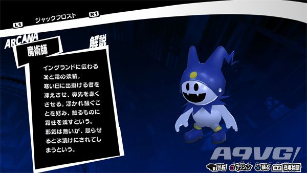

要求【群体冰属性小伤害技能】的雪人，最简单的就是在斑目美术馆抓到的雪人练到 12 级就能够学会了。

## **1→2 　会[芙雷](/skills/核热#芙雷)的「[天钿女命](/personas/恋爱#天钿女命)」**

要求【单体辐射属性小伤害技能】的[天钿女命](/personas/恋爱#天钿女命)，可以使用[朱雀](/personas/太阳#朱雀)（太阳 Lv16）× [贝利亚](/personas/恶魔#贝利亚)（法王 Lv9）来合成。

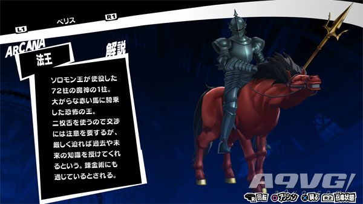

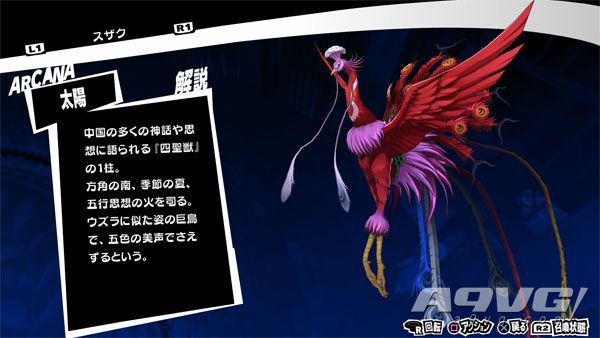

## **2→3 　带[塔尔卡加](/skills/辅助#塔尔卡加)的「[佛劳洛斯](/personas/恶魔#佛劳洛斯)」**

要求【攻击力上升技能】的[佛劳洛斯](/personas/恶魔#佛劳洛斯)，要求集体断头合成。这三只比较好找，都可以在美术馆遇见。并且[埃力格](/personas/皇帝#埃力格)不需要练就自带达尔卡加。

[贝利亚](/personas/恶魔#贝利亚)（法王 Lv9）× [欧若博司](/personas/教皇#欧若博司)（法王 Lv17）× [埃力格](/personas/皇帝#埃力格)（皇帝 Lv16）

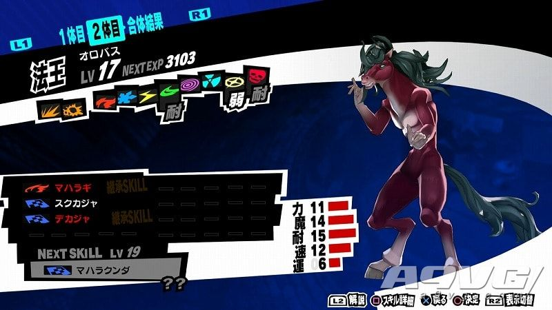

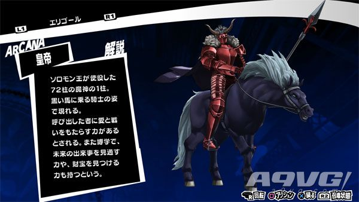

## **3→4 　带[反击](/skills/被动#反击)的「[凤凰](/personas/信念#凤凰)」**

要求【10%几率自动[反击](/skills/被动#反击)的技能】的[凤凰](/personas/信念#凤凰)，可以用[母夜叉](/personas/女皇#母夜叉)（女帝 Lv20）× [玄武](/personas/节制#玄武)（节制 Lv7）

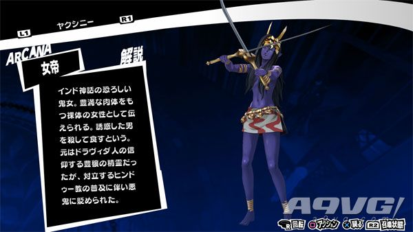

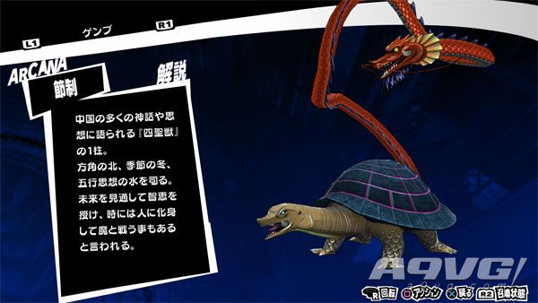

## **4→5 　带拉克卡加的「[瑟坦特](/personas/皇帝#瑟坦特)」**

要求【3 回合内防御力上升的】的[瑟坦特](/personas/皇帝#瑟坦特)，用[拉弥亚](/personas/女皇#拉弥亚)（女帝 Lv26）和[飞天](/personas/女教皇#飞天)（女教皇 Lv11）合成。

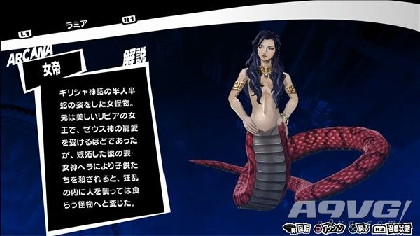

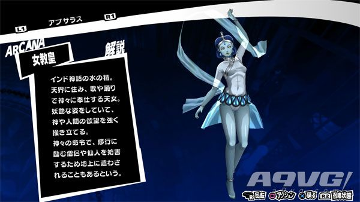

## **5→6 　带德卡加的「[猫将军](/personas/星#猫将军)」**

要求【消除敌方能力上升效果技能】的[猫将军](/personas/星#猫将军)，用 [木灵](/personas/星#木灵)（星 Lv11） × [山灵](/personas/隐者#山灵)（隐士 Lv17）× [安祖](/personas/教皇#安祖)（教皇 Lv28）合成。

德卡加在[安祖](/personas/教皇#安祖) 28 级的时候学会，或[安祖](/personas/教皇#安祖)（法王 Lv.25）用电椅处刑道具化为[迪卡加](/skills/辅助#迪卡加)技能卡，然后给[猫将军](/personas/星#猫将军)学习。

[木灵](/personas/星#木灵)与魑魅在地下迷宫很多，[安祖](/personas/教皇#安祖)在第四迷宫里很多。

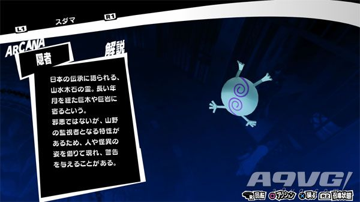

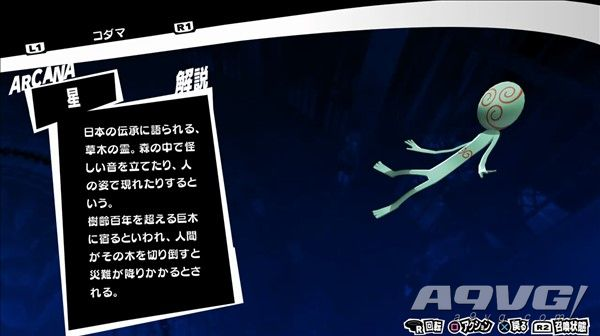

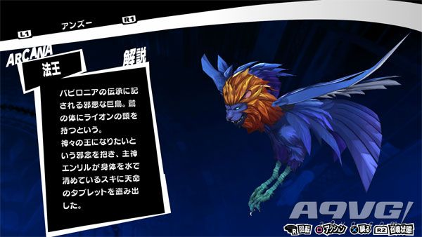

## **6→7 　带特托拉加的「[拉克西斯](/personas/命运#拉克西斯)」**

要求【给己方单体张开防御 1 次即死攻击的屏障技能】的[拉克西斯](/personas/命运#拉克西斯)，分两个步骤进行。

首先用带有特托拉加技能的权[天使](/personas/正义#天使)（正义 Lv29）和[睡魔](/personas/魔术师#睡魔)（魔术师 Lv23）合成[图特](/personas/皇帝#图特)（皇帝 Lv36），之后再用[图特](/personas/皇帝#图特)（皇帝 Lv36）× [安祖](/personas/教皇#安祖)（法王 Lv.25）合成[拉克西斯](/personas/命运#拉克西斯)。

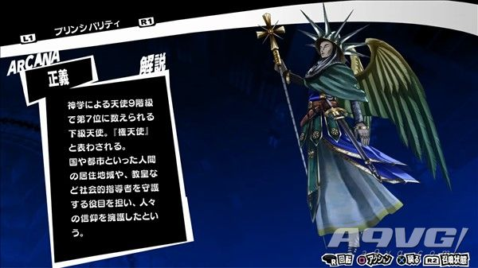

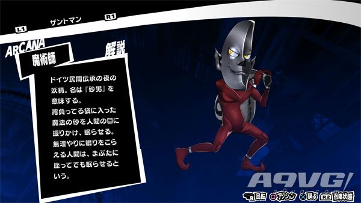

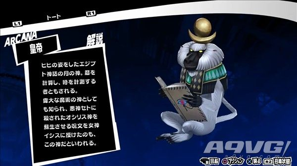

## **7→8 　带玛哈斯昆达的「[百臂巨人](/personas/倒悬者#百臂巨人)」**

要求【3 回合内降低敌方全体命中与回避的技能】的[百臂巨人](/personas/倒悬者#百臂巨人)。在第七迷宫可以找到[莉莉姆](/personas/恶魔#莉莉姆)（恶魔 Lv.32）在 34 级的时候可以学会玛哈斯昆达。之后与[安祖](/personas/教皇#安祖)（法王 Lv.25）合成即可。

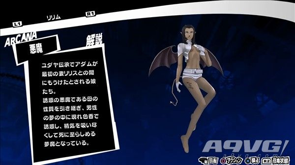

## **8→9 　带有萨玛立卡姆的「[巴古斯](/personas/愚者#巴古斯)」**

要求【HP 全恢复复活技能】的[巴古斯](/personas/愚者#巴古斯)。第九级需要完成一个早期支线获得该 Persona 的解锁道具才可以合成（任务名称：眼瞳扭曲的网络跟踪狂女子）。

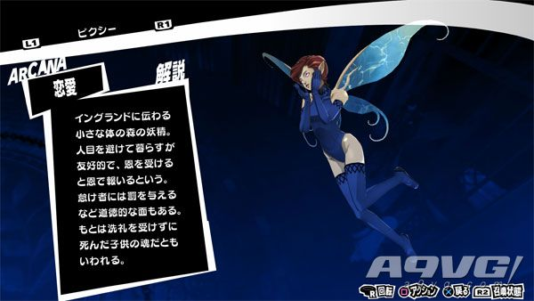

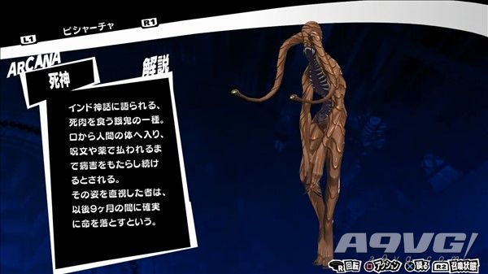

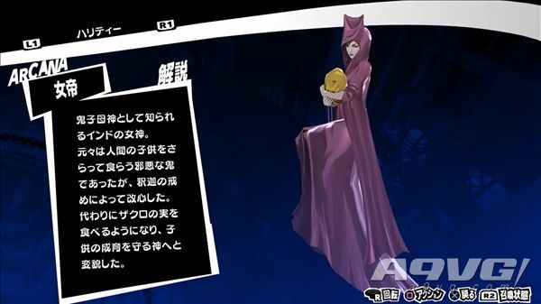

需要的 Persona 是[皮克希](/personas/恋爱#皮克希)（恋爱 Lv2）、[畢舍遮](/personas/死神#畢舍遮)（死神 Lv.28）和[诃梨帝母](/personas/女皇#诃梨帝母)（女帝 Lv41）。

## **9→10 　带高级[反击](/skills/被动#反击)的「[[赛](/skills/念动#赛)特](</personas/塔#[赛](/skills/念动#赛)特>)」**

要求【20%几率自动[反击](/skills/被动#反击)的技能】的[[赛](/skills/念动#赛)特](</personas/塔#[赛](/skills/念动#赛)特>)，先把[荼吉尼](/personas/女皇#荼吉尼)（女帝 Lv50）练到 52 级，学会高级[反击](/skills/被动#反击)。可以在第七迷宫获得，可用第六迷宫抓到的宝魔来喂经验。之后进行合成[荼吉尼](/personas/女皇#荼吉尼)（女帝 Lv50）× [天钿女命](/personas/恋爱#天钿女命)（恋爱 Lv13），获得会高级[反击](/skills/被动#反击)的[阿努比斯](/personas/审判#阿努比斯)（审判 Lv34）。

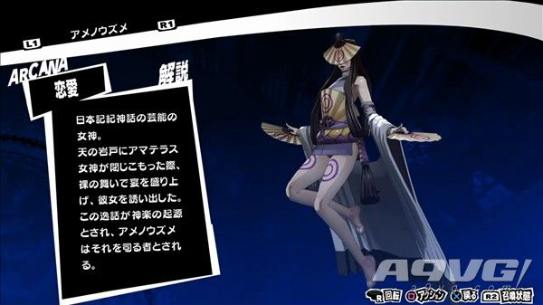

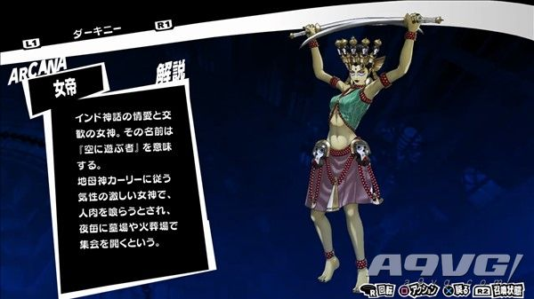

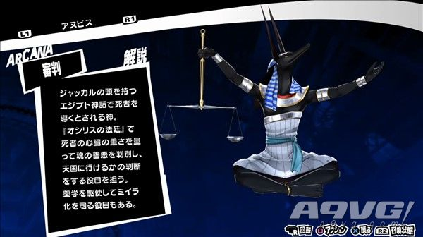

之后再进行合成，用继承了高击[反击](/skills/被动#反击)的[阿努比斯](/personas/审判#阿努比斯)（审判 Lv34）× [荷鲁斯](/personas/太阳#荷鲁斯)（太阳 Lv47）× [伊西丝](/personas/女教皇#伊西丝)（女教皇 Lv26）× [图特](/personas/皇帝#图特)（皇帝 Lv36）可获得。

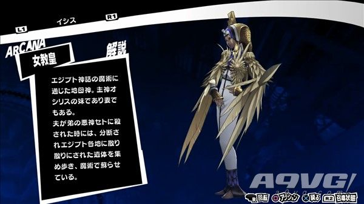

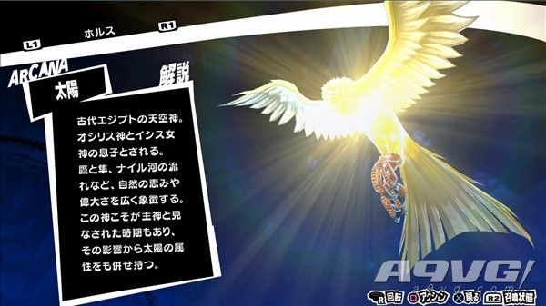

